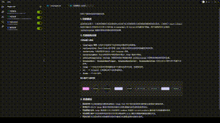

<div align="center">
  
  <h3>CodeAsk - Code Analysis Tool</h3>
  <p>Specializes in: Legacy code left by former developers, cryptic open-source projects, self-made spaghetti code, and riddle-like comments.</p>

</div>

<div align="center">

[](LICENSE)
[](https://nodejs.org)
[](https://reactjs.org/)
[](https://www.electronjs.org/)

</div>

## 📖 Introduction

### Ever stared at legacy code and felt:
- Your code breeds like rabbits (I SWEAR I DIDN'T TOUCH THAT FILE!)
- Previous dev was a part-time psychic ("needs optimization" → Optimize WHAT exactly?)
- New hires resign after 3 days ("I've seen code, but this... this is ART")
- Comments saying "temporary fix" (that's been running longer than _Friends_ reruns)
- The moment you understand the mess – congrats, you're now part of the problem

### CodeAsk - How to Survive Legacy Spaghetti Code
CodeAsk is a code analysis tool powered by LLM. It provides:
- Intelligent code organization and analysis
- Security vulnerability detection
- Code quality assessment
- Other interesting code insights

Ultimately, it translates spaghetti code into plain human language, helping you quickly familiarize yourself with the codebase and create the illusion that "I can understand this legacy code." It helps newcomers inherit the legacy mess faster (and then join you in overtime until the ICU).

## 🎥 Preview
<div align="center">
  
</div>

## 🚀 Quick Start
1. Clone the project
```bash
git clone https://github.com/woniu9524/CodeAsk.git
```
2. Install dependencies
```bash
cd codeask
npm install --legacy-peer-deps
```
3. Start the application
```bash
npm run start
```

## 💡 Usage Guide
### 1. Project Configuration
- Use `File > Open Folder` to select the target code directory.
- Configure your LLM API key and parameters in the model settings.

### 2. Plugin Creation and Code Analysis
1. Create a plugin
2. Choose an appropriate analysis plugin
3. Start the analysis task to complete the analysis

### 3. Result Viewing
- Supports split-screen comparison (original spaghetti code on the left, human-readable analysis on the right)
- Markdown format report display
- Mermaid chart support in markdown

## 🔧 Tech Stack
- **Core Framework**
    - React 19
    - Electron
    - TypeScript
- **State Management**
    - Zustand
- **UI Components**
    - Shadcn/ui
    - Monaco Editor
    - ReactMarkdown
- **Development Tools**
    - Vite
    - ESLint
    - Prettier

## ⚠️ Pro Tip
When encountering bugs, chant "It's not a bug, it's a feature" three times before creating an issue. Works 0% of the time but makes you feel better.
