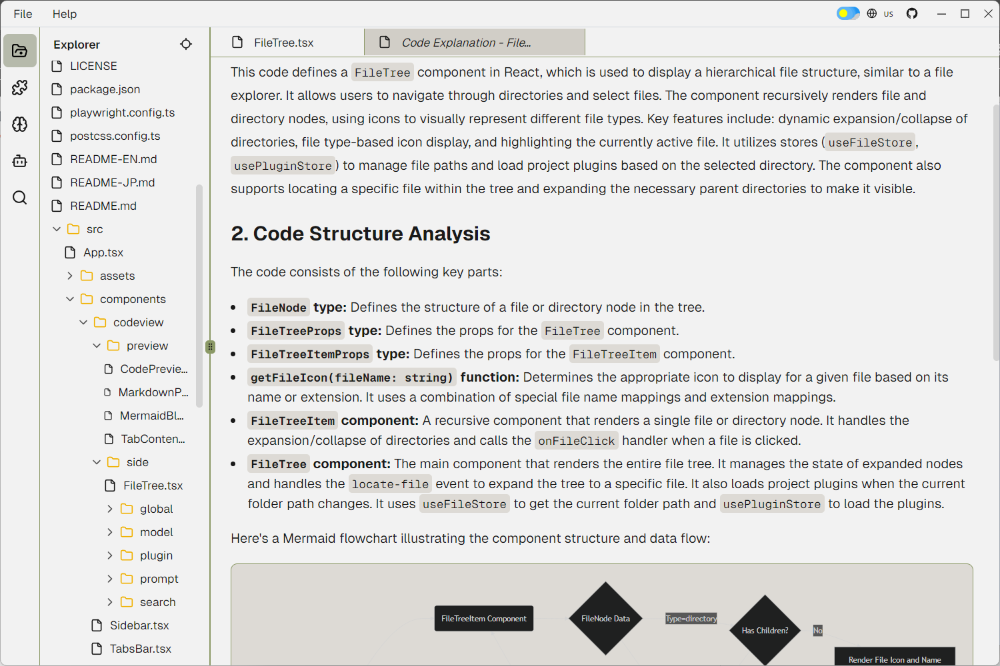
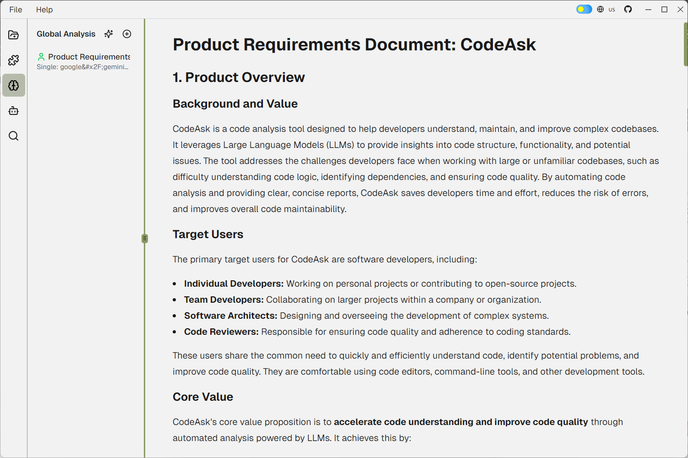

<div align="center">
  
  <h3>CodeAsk - Code Analysis Tool</h3>
  <p>Specializes in: Legacy code left by former developers, cryptic open-source projects, self-made spaghetti code, and riddle-like comments.</p>
  <p>
    <a href="README-EN.md">English</a> | 
    <a href="README.md">中文</a> | 
    <a href="README-JP.md">日本語</a>
  </p>
</div>

<div align="center">

[](LICENSE)
[](https://nodejs.org)
[](https://reactjs.org/)
[](https://www.electronjs.org/)

</div>

## 📖 Introduction

### Are you currently experiencing...:
- Your code breeds like rabbits (I SWEAR I DIDN'T TOUCH THAT FILE!)
- Previous dev was a part-time psychic ("needs optimization" → Optimize WHAT exactly?)
- New hires resign after 3 days ("I've seen code, but this... this is ART")
- Comments saying "temporary fix" (that's been running longer than _Friends_ reruns)
- The moment you understand the mess – congrats, you're now part of the problem

CodeAsk aims to solve the challenges developers face when dealing with complex codebases. By leveraging the power of Large Language Models (LLMs), CodeAsk can quickly analyze code, detect potential security vulnerabilities, assess code quality, and provide code organization and analysis reports, thereby improving development efficiency, reducing maintenance costs, and enhancing code quality.

## 🎥 Preview

<div align="center">
<table>
<tr>
<td align="center" width="50%">

</td>
<td align="center" width="50%">

</td>
</tr>
</table>

📺 [Watch Demo Video](https://www.youtube.com/watch?v=dQw4w9WgXcQ)
</div>

## 🌟 Core Features

- **Code Analysis**: Use large models to analyze codebases and generate code analysis reports.
- **Code Preview**: Provides read-only code preview functionality with theme switching and font size adjustment.
- **Markdown Preview**: Renders Markdown text as HTML preview, supporting Mermaid charts.
- **Global Code Analysis**: Create and configure global code analysis, allowing users to define analysis names, single-page analysis, and summary analysis models and prompts.
- **Plugin Management**: Manage code viewer plugins, allowing users to enable/disable, execute, edit, and delete plugins.
- **Model Management**: Manage language models, allowing users to add, edit, delete, and enable/disable models.
- **Split Screen Display**: Support split-screen display of different code files or plugin Markdown.

## 🚀 Quick Start

1. Clone the repository
```bash
git clone https://github.com/woniu9524/CodeAsk.git
```

2. Install dependencies
```bash
cd codeask
npm install --legacy-peer-deps
```

3. Start the application
```bash
npm run start
```

## 💡 Usage Guide

### 2.1. Launch the Application
- Start the CodeAsk application.

### 2.2. Select Code Directory
- In the top menu bar of the application window, select "File" -> "Open Folder".
- Choose the code directory you want to analyze.

### 2.3. Configure LLM API Key
- In the sidebar, click the "Models" button.
- Click the "Add Model" button to open the model configuration dialog.
- Fill in the model name, API key, baseUrl, and other information.
- Click the "Test" button to test the connection.
- Click the "Save" button to save the configuration.

### 2.4. Select Analysis Plugin
- In the sidebar, click the "Plugins" button.
- Click the "Add Plugin" button to open the plugin configuration dialog.
- Fill in the plugin name, select the model, and fill in the system prompt and user prompt.
- Click the "Save" button to save the configuration.

### 2.5. Execute Code Analysis
- In the plugin list, find the plugin you want to use.
- Click the "Execute" button corresponding to the plugin to open the plugin execution dialog.
- Select the files to analyze in the file tree, or enter file extension filter rules.
- Click the "Execute" button to start the analysis.

### 2.6. View Analysis Report
- After the analysis is complete, the results will be displayed in the code view area.
- You can switch between different files and plugin results in the tab bar.
- Markdown preview supports code highlighting and Mermaid charts.

### 2.7. Global Code Analysis
- In the sidebar, click the "Global Analysis" button.
- Click the "Add Analysis" button to open the global analysis configuration dialog.
- Fill in the analysis name, select the model, and fill in the prompts for single-page analysis and summary analysis.
- Click the "Save" button to save the configuration.
- In the global analysis list, find the analysis you want to execute.
- Click the "Execute" button corresponding to the analysis to open the global analysis execution dialog.
- Select the files to analyze, or enter file extension filter rules.
- Click the "Execute" button to start the analysis.
- After the analysis is complete, click the entry in the analysis list to view the analysis results on the global analysis page.

### 2.8. Sharing
- After analysis, a `.codeaskdata` file will be generated in the project directory, which can be shared with others
- Others can place it in the same location in their code
- Open the folder in CodeAsk to view the analysis results

## ❓ Frequently Asked Questions

### Model Configuration Notes
- Ollama does not require an apikey, so the apikey field can be filled with anything, such as 123
- The baseurl must be compatible with openai, generally it's the api followed by /v1
- Please set the concurrency number according to the capability of the api interface

## 🔧 Tech Stack

- **Core Framework**
  - React 19
  - Electron
  - TypeScript

- **State Management**
  - Zustand

- **UI Components**
  - Shadcn/ui
  - Monaco Editor
  - ReactMarkdown

- **Development Tools**
  - Vite
  - ESLint
  - Prettier

## 🚧 Future Development Plans
- ✅ Complete project analysis and organization
- 🚧 VS Code plugin

## ⚠️ Special Notes
- ⚠️ If you encounter a BUG, please chant "This is not a BUG, it's a feature" three times before submitting an issue.
- ⚠️ For company confidential projects, it is recommended to use [Ollama](https://ollama.com/) for local deployment
- ⚠️ Most prompt templates are generated by DeepSeek, and many have not been tested. They are only intended to provide inspiration for various creative use cases. You still need to adjust them according to your specific model and code situation. Feel free to share interesting prompts in the issues.
