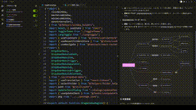

<div align="center">

<h3>CodeAsk - コード地獄脱出ツール</h3>
<p>専門治療：前任者の逃亡コード、闇OSS、自爆式クソコード、謎コメントなど</p>
</div>

<div align="center">

[](LICENSE)
[](https://nodejs.org)
[](https://reactjs.org/)
[](https://www.electronjs.org/)

</div>

## 📖 これは何？

### あなたもこんな闇コードで悩んでいないか？
- コードが無性増殖する（俺は触ってねぇぞ！）
- 前任者は謎かけ職人（「ここ要最適化」→ どこだよ！具体的に教えろ！）
- 新人が三日で退職願い（「コードが…理解不能です…でも感動しました」）
- コメントに「暫定対応」と書いてある（3年経過してもそのまま、結婚より長続き）
- コードを理解した瞬間 → おめでとう、あなたも闇の住人です

### CodeAsk - 闇コード生存戦略
LLMを使ったコード解析ツール。以下の機能で闇を光に変える：
- コードの自動解剖
- セキュリティ穴探し
- コード品質診断
- その他おもしろ解析機能

最終目標：クソコードを人間語に翻訳し「私でも闇コードわかるかも」という妄想を抱かせ、新人を早期に闇の世界に同化させる（その後全員で過労死ラインへ）

## 🎥 デモ

<div align="center">
<table>
<tr>
<td align="center" width="50%">

</td>
<td align="center" width="50%">

</td>
</tr>
</table>
</div>

## 🚀 クイックスタート

1. リポジトリをクローン
```bash
git clone https://github.com/woniu9524/CodeAsk.git
```

2. 依存関係をインストール
```bash
cd codeask
npm install --legacy-peer-deps
```

3. アプリ起動
```bash
npm run start
```

## 💡 使い方

### 1. プロジェクト設定
- `ファイル > フォルダを開く` で対象コードを選択
- モデル設定でLLM APIキーを設定

### 2. プラグインで解析
1. プラグイン作成
2. 解析タイプを選択
3. タスク実行

### 3. 結果確認
- 分割画面比較
- Markdownレポート生成
- mermaid図表サポート

### 4. 共有
- 解析後に.codeaskdataファイルが生成されます
- このファイルを共有し、同じディレクトリに配置してもらいます
- CodeAskでフォルダを開くと解析結果を確認できます

## 🔧 技術構成

- **主要フレームワーク**
  - React 19
  - Electron
  - TypeScript

- **状態管理**
  - Zustand

- **UIコンポーネント**
  - Shadcn/ui
  - Monaco Editor
  - ReactMarkdown

- **開発ツール**
  - Vite
  - ESLint
  - Prettier

## ⚠️ 警告
バグを見つけたら「これは仕様です」と3回唱えてからIssueを投稿してください。

プロンプトテンプレートの大部分はDeepSeekによって生成され、多くは未検証です。これらは創造的な使用例のインスピレーションを提供することを目的としています。実際の使用時は、お使いのモデルやコードの状況に応じて適宜調整してください。面白いプロンプトがありましたら、ぜひissuesで共有してください。
