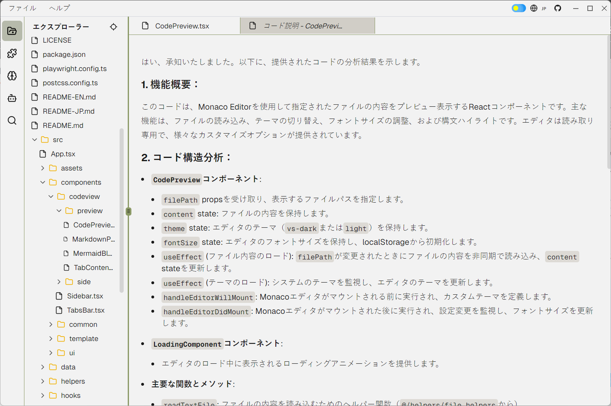
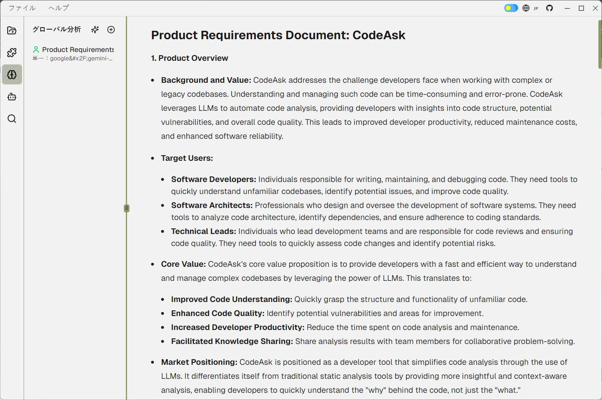

<div align="center">

<h3>CodeAsk - コード地獄脱出ツール</h3>
<p>専門治療：前任者の逃亡コード、闇OSS、自爆式クソコード、謎コメントなど</p>
<p>
  <a href="README-EN.md">English</a> | 
  <a href="README.md">中文</a> | 
  <a href="README-JP.md">日本語</a>
</p>
</div>

<div align="center">

[](LICENSE)
[](https://nodejs.org)
[](https://reactjs.org/)
[](https://www.electronjs.org/)

</div>

## 📖 これは何？

###  あなたは現在、...を経験していますか？
- コードが無性増殖する（俺は触ってねぇぞ！）
- 前任者は謎かけ職人（「ここ要最適化」→ どこだよ！具体的に教えろ！）
- 新人が三日で退職願い（「コードが…理解不能です…でも感動しました」）
- コメントに「暫定対応」と書いてある（3年経過してもそのまま、結婚より長続き）
- コードを理解した瞬間 → おめでとう、あなたも闇の住人です

CodeAskは、開発者が複雑なコードベースに直面した際の理解と保守の困難さを解決することを目的としています。大規模言語モデル（LLM）の能力を活用することで、CodeAskはコードを迅速に分析し、潜在的なセキュリティ脆弱性を検出し、コード品質を評価し、コード整理と分析レポートを提供することができます。これにより、開発効率の向上、保守コストの削減、コード品質の向上を実現します。

## 🎥 デモ

<div align="center">
<table>
<tr>
<td align="center" width="50%">

</td>
<td align="center" width="50%">

</td>
</tr>
</table>

📺 [デモ動画を見る](https://www.nicovideo.jp/watch/sm9)
</div>

## 🌟 主な機能

- **コード分析**：大規模モデルを使用してコードベースを分析し、コード分析レポートを生成します。
- **コードプレビュー**：読み取り専用のコードプレビュー機能を提供し、テーマの切り替えやフォントサイズの調整をサポートします。
- **Markdownプレビュー**：MarkdownテキストをHTMLプレビューとしてレンダリングし、Mermaidチャートをサポートします。
- **グローバルコード分析**：グローバルコード分析の作成と設定が可能で、分析名、単一ページ分析、要約分析のモデルとプロンプトを定義できます。
- **プラグイン管理**：コードビューアプラグインを管理し、有効/無効化、実行、編集、削除が可能です。
- **モデル管理**：言語モデルを管理し、追加、編集、削除、有効/無効化が可能です。
- **分割画面表示**：異なるコードファイルやプラグインMarkdownの分割画面表示をサポートします。

## 🚀 クイックスタート

1. リポジトリをクローン
```bash
git clone https://github.com/woniu9524/CodeAsk.git
```

2. 依存関係をインストール
```bash
cd codeask
npm install --legacy-peer-deps
```

3. アプリ起動
```bash
npm run start
```

## 💡 使い方

### 2.1. アプリケーションの起動
- CodeAskアプリケーションを起動します。

### 2.2. コードディレクトリの選択
- アプリケーションウィンドウの上部メニューバーで、「File」→「Open Folder」を選択します。
- 分析したいコードディレクトリを選択します。

### 2.3. LLM APIキーの設定
- サイドバーで「Models」ボタンをクリックします。
- 「Add Model」ボタンをクリックして、モデル設定ダイアログを開きます。
- モデル名、APIキー、baseUrlなどの情報を入力します。
- 「Test」ボタンをクリックして接続をテストします。
- 「Save」ボタンをクリックして設定を保存します。

### 2.4. 分析プラグインの選択
- サイドバーで「Plugins」ボタンをクリックします。
- 「Add Plugin」ボタンをクリックして、プラグイン設定ダイアログを開きます。
- プラグイン名を入力し、モデルを選択し、システムプロンプトとユーザープロンプトを入力します。
- 「Save」ボタンをクリックして設定を保存します。

### 2.5. コード分析の実行
- プラグインリストで、使用したいプラグインを見つけます。
- プラグインに対応する「Execute」ボタンをクリックして、プラグイン実行ダイアログを開きます。
- ファイルツリーで分析するファイルを選択するか、ファイル拡張子フィルタールールを入力します。
- 「Execute」ボタンをクリックして分析を開始します。

### 2.6. 分析レポートの表示
- 分析が完了すると、結果がコードビュー領域に表示されます。
- タブバーで異なるファイルやプラグイン結果を切り替えることができます。
- Markdownプレビューはコードハイライトとmermaidチャートをサポートしています。

### 2.7. グローバルコード分析
- サイドバーで「Global Analysis」ボタンをクリックします。
- 「Add Analysis」ボタンをクリックして、グローバル分析設定ダイアログを開きます。
- 分析名を入力し、モデルを選択し、単一ページ分析と要約分析のプロンプトを入力します。
- 「Save」ボタンをクリックして設定を保存します。
- グローバル分析リストで、実行したい分析を見つけます。
- 分析に対応する「Execute」ボタンをクリックして、グローバル分析実行ダイアログを開きます。
- 分析するファイルを選択するか、ファイル拡張子フィルタールールを入力します。
- 「Execute」ボタンをクリックして分析を開始します。
- 分析が完了したら、分析リストのエントリをクリックして、グローバル分析ページで分析結果を表示します。

### 2.8. 共有
- 分析後、プロジェクトディレクトリに`.codeaskdata`ファイルが生成されます
- このファイルを他の人と共有し、コードの同じ場所に配置してもらいます
- CodeAskでフォルダを開くと分析結果を確認できます

## ❓ よくある質問

### モデル設定の注意点
- Ollamaはapikeyを必要としないため、apikeyフィールドには何でも入力できます（例：123）
- baseurlはopenaiと互換性がある必要があります。一般的にはapiの後に/v1を付けます
- 並行処理数はapiインターフェースの能力に応じて設定してください

## 🔧 技術構成

- **主要フレームワーク**
  - React 19
  - Electron
  - TypeScript

- **状態管理**
  - Zustand

- **UIコンポーネント**
  - Shadcn/ui
  - Monaco Editor
  - ReactMarkdown

- **開発ツール**
  - Vite
  - ESLint
  - Prettier

## 🚧 今後の開発計画
- ✅ プロジェクト全体の分析と整理
- 🚧 VS Codeプラグイン

## ⚠️ 特記事項
- ⚠️ バグに遭遇した場合は、「これはバグではなく機能です」と3回唱えてからissueを提出してください。
- ⚠️ 企業の機密プロジェクトには、[Ollama](https://ollama.com/)のローカルデプロイメントを推奨します
- ⚠️ プロンプトテンプレートの大部分はDeepSeekによって生成され、多くはテストされていません。これらは様々な創造的な使用例のインスピレーションを提供することを目的としています。実際には、特定のモデルやコードの状況に応じて調整する必要があります。面白いプロンプトがあれば、issuesで共有してください。
