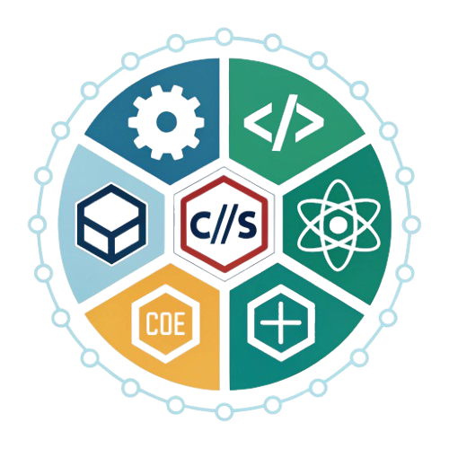
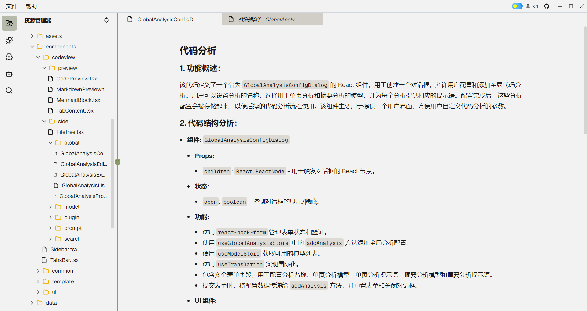
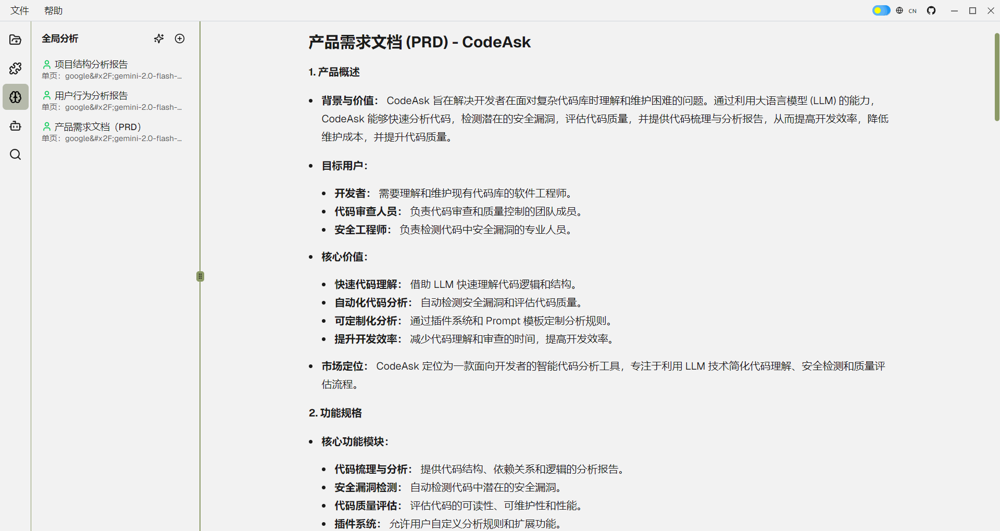

<div align="center">
  
  <h3>CodeAsk - 代码分析工具</h3>
  <p>专治：前任跑路代码、开源天书、自产屎山、谜语人注释等疑难杂症</p>
  <p>
    <a href="README-EN.md">English</a> | 
    <a href="README.md">中文</a> | 
    <a href="README-JP.md">日本語</a>
  </p>
</div>

<div align="center">

[](LICENSE)
[](https://nodejs.org)
[](https://reactjs.org/)
[](https://www.electronjs.org/)

</div>

## 📖 简介

### 你是否正在经历...：

- 代码会自己生孩子（我TM根本没动过！）
- 前任是谜语人转世（"这里要优化" -> 你倒是说清楚优化哪里啊？）
- 新人入职三小时就打开BOSS直聘（"这代码有它自己的想法"）
- 注释写着"暂时方案"（结果一用就是三年，比婚姻还持久）
- 当你终于看懂屎山时——恭喜，你已成为屎山の一部分


CodeAsk 旨在解决开发者在面对复杂代码库时理解和维护困难的问题。通过利用大语言模型 (LLM) 的能力，CodeAsk 能够快速分析代码，检测潜在的安全漏洞，评估代码质量，并提供代码梳理与分析报告，从而提高开发效率，降低维护成本，并提升代码质量。

## 🎥 预览

<div align="center">
<table>
<tr>
<td align="center" width="50%">

</td>
<td align="center" width="50%">

</td>
</tr>
</table>

📺 [观看演示视频](https://bilibili.com/video/BV1eQNzeuEEb/)
</div>

## 🌟 核心功能

- **代码分析**：使用大模型分析代码库，生成代码分析报告。
- **代码预览**：提供只读的代码预览功能，支持主题切换和字体大小调整。
- **Markdown 预览**：将 Markdown 文本渲染为 HTML 预览，支持 Mermaid 图表。
- **全局代码分析**：创建和配置全局代码分析，允许用户定义分析名称、单页分析和总结分析的模型及提示语。
- **插件管理**：管理代码查看器插件，允许用户启用/禁用、执行、编辑和删除插件。
- **模型管理**：管理语言模型，允许用户添加、编辑、删除和启用/禁用模型。
- **分屏显示**：支持分屏显示不同的代码文件或插件 Markdown。

## 🚀 快速开始

1. 克隆项目
```bash
git clone https://github.com/woniu9524/CodeAsk.git
```

2. 安装依赖
```bash
cd codeask
npm install --legacy-peer-deps
```

3. 启动应用
```bash
npm run start
```

## 💡 使用指南

### 2.1. 启动应用
- 启动 CodeAsk 应用程序。

### 2.2. 选择代码目录
- 在应用窗口的顶部菜单栏中，选择 "File" -> "Open Folder"。
- 选择您要分析的代码目录。

### 2.3. 配置 LLM API 密钥
- 在侧边栏中，点击 "Models" 按钮。
- 点击 "Add Model" 按钮，打开模型配置对话框。
- 填写模型名称、API 密钥、baseUrl 等信息。
- 点击 "Test" 按钮测试连接。
- 点击 "Save" 按钮保存配置。

### 2.4. 选择分析插件
- 在侧边栏中，点击 "Plugins" 按钮。
- 点击 "Add Plugin" 按钮，打开插件配置对话框。
- 填写插件名称、选择模型、填写系统提示和用户提示。
- 点击 "Save" 按钮保存配置。

### 2.5. 执行代码分析
- 在插件列表中，找到您要使用的插件。
- 点击插件对应的 "Execute" 按钮，打开插件执行对话框。
- 在文件树中选择要分析的文件，或者输入文件扩展名过滤规则。
- 点击 "Execute" 按钮开始分析。

### 2.6. 查看分析报告
- 分析完成后，结果将显示在代码视图区域。
- 您可以在标签栏中切换不同的文件和插件结果。
- Markdown 预览支持代码高亮和 Mermaid 图表。

### 2.7. 全局代码分析
- 在侧边栏中，点击 "Global Analysis" 按钮。
- 点击 "Add Analysis" 按钮，打开全局分析配置对话框。
- 填写分析名称、选择模型、填写单页分析和总结分析的提示语。
- 点击 "Save" 按钮保存配置。
- 在全局分析列表中，找到您要执行的分析。
- 点击分析对应的 "Execute" 按钮，打开全局分析执行对话框。
- 选择要分析的文件，或者输入文件扩展名过滤规则。
- 点击 "Execute" 按钮开始分析。
- 分析完成后，点击分析列表中的条目，即可在全局分析页面查看分析结果。

### 2.8. 分享
- 分析后会在项目目录下生成一个 `.codeaskdata` 的文件，可以分享给其他人
- 其他人收到后，放在代码的同一位置
- 在 CodeAsk 中打开文件夹即可查看分析结果

## ❓ 常见问题

### 模型配置注意点
- Ollama 不需要 apikey，所以 apikey 字段可以随便填，比如 123
- baseurl 必须要使用兼容 openai 的，一般来说是 api 后面加 /v1
- 并发数量请根据 api 接口能力而定


## 🔧 技术栈

- **核心框架**
  - React 19
  - Electron
  - TypeScript

- **状态管理**
  - Zustand

- **UI 组件**
  - Shadcn/ui
  - Monaco Editor
  - ReactMarkdown

- **开发工具**
  - Vite
  - ESLint
  - Prettier

## 🚧 后续开发计划
- ✅ 整个项目分析梳理
- 🚧 VS Code 插件

## ⚠️ 特别说明
- ⚠️ 如遇 BUG，请默念「这不是 BUG 是特性」三次后提交 issue。
- ⚠️ 公司机密项目建议使用 [Ollama](https://ollama.com/) 本地部署
- ⚠️ 提示词模板大多由 DeepSeek 生成，大多我也没有测试，只是希望给大家一些奇奇怪怪的灵感。具体还是需要根据自己使用模型和代码实际情况进行调整。欢迎大家在 issues 中分享有趣的提示词。
