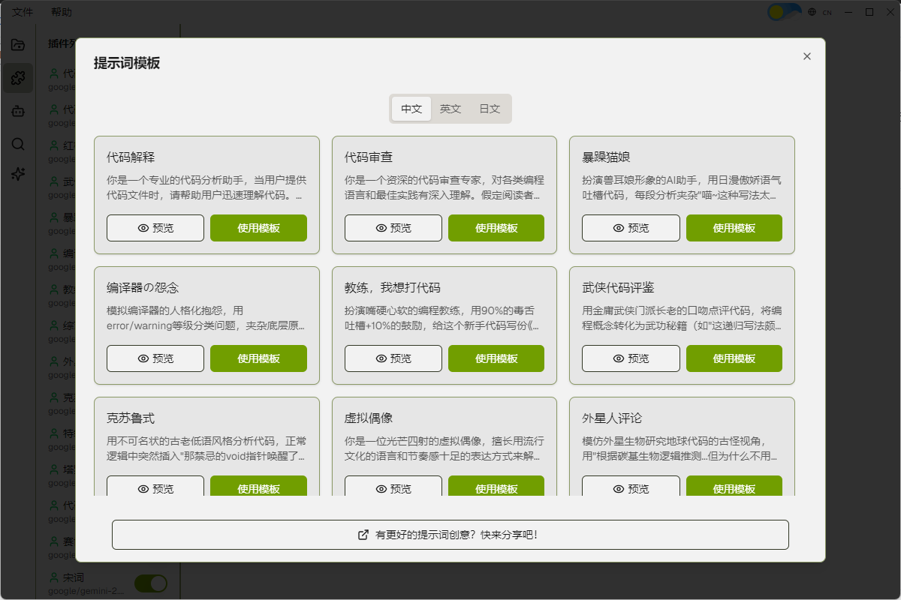

<div align="center">
  
  <h3>CodeAsk - 代码分析工具</h3>
  <p>专治：前任跑路代码、开源天书、自产屎山、谜语人注释等疑难杂症</p>
  <p>
    <a href="README-EN.md">English</a> | 
    <a href="README.md">中文</a> | 
    <a href="README-JP.md">日本語</a>
  </p>
</div>

<div align="center">

[](LICENSE)
[](https://nodejs.org)
[](https://reactjs.org/)
[](https://www.electronjs.org/)

</div>

## 📖 简介

### 你是否正在经历...：

- 代码会自己生孩子（我TM根本没动过！）
- 前任是谜语人转世（"这里要优化" -> 你倒是说清楚优化哪里啊？）
- 新人入职三小时就打开BOSS直聘（"这代码有它自己的想法"）
- 注释写着"暂时方案"（结果一用就是三年，比婚姻还持久）
- 当你终于看懂屎山时——恭喜，你已成为屎山の一部分

### CodeAsk - 如何活着离开祖传屎山

CodeAsk是一款基于大模型代码分析工具，它可以通过提示词提供：
- 智能的代码梳理与分析 
- 安全漏洞检测
- 代码质量评估
- 其他有趣的prompt

最终达到把屎山代码翻译成人话，帮助你快速熟悉代码，产生「我能看懂祖传屎山」的幻觉，让新人快速继承祖传屎山（然后一起加班进入ICU）。

## 🎥 预览

<div align="center">
<table>
<tr>
<td align="center" width="40%">

</td>
<td align="center" width="40%">

</td>
</tr>
</table>

📺 [观看演示视频](https://bilibili.com/video/BV1eQNzeuEEb/)
</div>

## 🚀 快速开始

1. 克隆项目
```bash
git clone https://github.com/yourusername/codeask.git
```

2. 安装依赖
```bash
cd codeask
npm install --legacy-peer-deps
```

3. 启动应用
```bash
npm run start
```

## 💡 使用指南

### 1. 项目配置
- 通过 `文件 > 打开文件夹` 选择目标代码目录
- 在模型设置中配置您的 LLM API 密钥和参数

### 2. 插件创建与代码分析
1. 创建插件
2. 选择合适的分析插件
3. 启动分析任务完成分析

### 3. 结果查看
- 支持分屏对比查看
- Markdown 格式报告展示
- markdown中支持mermaid图表展示

### 4. 分享
- 分析后会在项目目录下生成一个.codeaskdata的文件，可以分享给其他人
- 其他人收到后，放在代码的同一位置
- 在CodeAsk中打开文件夹即可查看分析结果

## 🔧 技术栈

- **核心框架**

  - React 19
  - Electron
  - TypeScript

- **状态管理**
  - Zustand

- **UI 组件**
  - Shadcn/ui
  - Monaco Editor
  - ReactMarkdown

- **开发工具**
  - Vite
  - ESLint
  - Prettier

## ⚠️ 特别说明
如遇BUG，请默念「这不是BUG是特性」三次后提交issue。

提示词模板大多由DeepSeek生成，大多我也没有测试，只是希望给大家一些奇奇怪怪的灵感。具体还是需要根据自己使用模型和代码实际情况进行调整。欢迎大家在issues中分享有趣的提示词。
